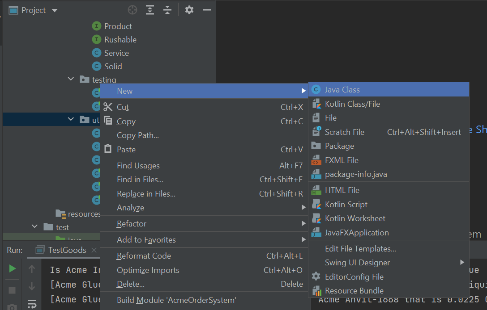
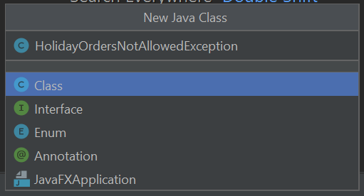
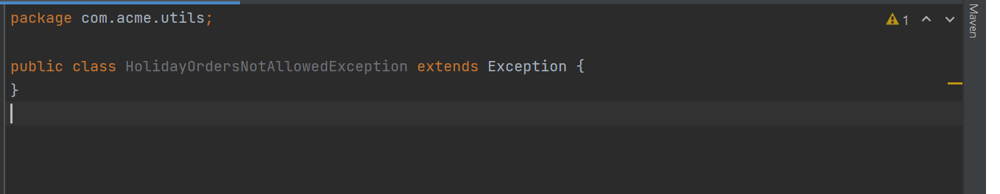

# Java-Exceptions-Lab-Section-18

Exception handling is a normal and required part of Java coding. In this lab, you
retrofit parts of your application to use Java exceptions where they just use
System.out to alert right now. System.out is not something that the application or a
user can effectively use to take action when a problem occurs.  

Specifically, in this lab you will:
* Create an exception class and use it to create an exception object
* See how to throw the exception object when the application detects a problem
or potential problem
* Learn how to use try-catch blocks to capture and react to problems
* Learn how to rethrow an exception as another way to handle an exception

## Scenario

There are several places in the Acme Order System that check for valid data. For
example, in the MyDate class, the valid( ) method checks to ensure proper day,
month, and year data are supplied when creating or updating a MyDate instance. In
the Order class, orders are not allowed to be created with order dates of holidays.
However, in both of these examples, when bad data is provided, the application does
not stop or otherwise return an indication of problem to the offending method
caller. Instead, the data is just not accepted. This might be a worse bug than
actually having the application fail! In this lab, you create a new Exception class and
have an instance of this exception thrown to the caller if an Order is created with a
holiday date as its order date.

## Step 1: Create the HolidayOrdersNotAllowedException

1.1 Create HolidayOrdersNotAllowedException. Right-click on the
com.acme.utils package and select New > Java Class.

In the resulting New Java Class window, enter
HolidayOrdersNotAllowedException, and press Enter. 

Type "extends Exception" to ensure that the Superclass is java.lang.Exception. 

